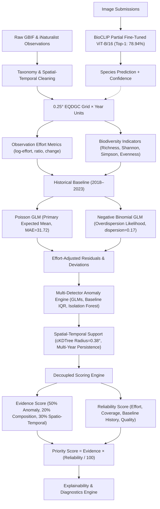

# BioSentinel India — Final System Architecture

## 1. Executive Overview

BioSentinel India is a multi-stage biodiversity observation-intelligence and anomaly screening pipeline designed to monitor ecological change across terrestrial India. It processes heterogeneous, volunteer-contributed biodiversity observations and transforms them into effort-adjusted, historically grounded, explainable screening signals.

Rather than treating raw occurrence spikes or drops as genuine ecological shifts, BioSentinel decouples observation effort from biological signals, models historical baseline expectations, integrates multi-detector statistical anomalies, and produces a decoupled priority score balanced by observation reliability.

---

## 2. Direct vs. Inferred Quantities

To prevent misleading ecological claims, BioSentinel strictly categorizes every variable into **Direct Quantities** (measured or recorded in the field) and **Inferred Quantities** (model-derived or statistical constructs).

| Category | Field Name | Type | Definition & Epistemic Boundaries |
| :--- | :--- | :--- | :--- |
| **Identity** | `eqdcellcode` | Direct | Standardized 0.25° Equal-Area Grid Cell Code. |
| **Identity** | `latitude`, `longitude` | Inferred | **Approximate centroid** of the 0.25° grid cell (~25km × 25km), not the exact GPS coordinate of an individual organism. |
| **Observation** | `total_occurrences` | Direct | Total counts of submitted species records within the cell-year. Represents **sampling effort**, NOT abundance. |
| **Observation** | `species_richness` | Direct | Count of distinct species reported within the cell-year. Subject to collector bias and observation volume. |
| **Observation** | `shannon_diversity`, `simpson_diversity` | Direct / Math | Non-parametric index computed directly from observed frequency distribution. |
| **Effort** | `log_effort`, `effort_ratio`, `effort_change_pct` | Inferred | Logarithmic and relative transformations of observation frequency across years. |
| **Baseline** | `historical_mean`, `historical_median` | Inferred | Summary statistics computed strictly across historical training years (2018–2023). |
| **Baseline** | `poisson_expected_richness` | Inferred | **Primary Expected-Mean Baseline** predicted conditionally given `log_effort` and scaled time ($MAE = 31.72$). |
| **Baseline** | `negative_binomial_expected_richness` | Inferred | **Overdispersion / Robustness Model** expectation ($\text{AIC} = 112,335.54$, $\phi = 0.1742$). |
| **Deviation** | `relative_deviation`, `standardized_residual` | Inferred | Statistical distance between observed richness and effort-adjusted expectation. |
| **Temporal** | `effort_adjusted_trend` | Inferred | Dual-slope categorization distinguishing true residual trends from sampling growth. |
| **Anomaly** | `combined_anomaly_score`, `method_agreement` | Inferred | Multi-detector consensus across statistical bounds, GLM deviance, and Isolation Forest. |
| **Screening** | `evidence_score`, `reliability_score`, `priority_score` | Inferred | Composite decision-support indicators for survey prioritization. **Does NOT prove loss or harm.** |
| **Vision** | `bioclip_confidence` | Inferred | Cosine-classifier probability output for image classification; applies strictly to evaluated images, not raw GBIF records. |

---

## 3. End-to-End Pipeline Architecture

### Stage 1: Data Sources & Cleaning
- **Occurrence Pipeline:** Global Biodiversity Information Facility (GBIF) terrestrial animal occurrences across India (2018–2024). Filtering removes marine, fossil, and non-terrestrial coordinates.
- **Taxonomic Normalization:** Canonical taxonomic hierarchy mapped to Kingdom, Class, Order, Family, Genus, Species, and SpeciesKey.
- **Spatial Aggregation:** Partitioned into Equal-Area Grid Cells (EQDGC 0.25° resolution, approximately 25km × 25km).

### Stage 2: Observation Effort & Biodiversity Indicators
- **Effort Quantification:**
  $$\text{log\_effort} = \ln(1 + \text{total\_occurrences})$$
  $$\text{effort\_ratio} = \frac{\text{total\_occurrences}}{\text{historical\_occurrence\_median}}$$
  $$\text{effort\_change\_pct} = \frac{\text{total\_occurrences}_t - \text{total\_occurrences}_{t-1}}{\text{total\_occurrences}_{t-1}} \times 100$$
- **Diversity Indices:** Shannon entropy ($H'$), Simpson dominance ($D$), and Pielou's evenness ($J'$).

### Stage 3: Historical Baseline & Dual GLM Formulation
To eliminate lookahead bias, historical models are trained strictly on eligible units from 2018–2023 ($N = 10,283$ units across $2,773$ unique cells, requiring $\ge 3$ historical years):
1. **Poisson GLM (Primary Conditional Mean Baseline):**
   $$\ln(\mathbb{E}[\text{richness}]) = \beta_0 + \beta_1 \ln(\text{effort}) + \beta_2 \cdot \text{year}$$
   - **Role:** Point forecasting baseline minimizing walk-forward absolute deviation ($\text{MAE} = 31.72$, compared to Historical Median $\text{MAE} = 46.20$).
2. **Negative Binomial GLM (Overdispersion & Robustness Likelihood):**
   - **Role:** Variance calibration and probabilistic uncertainty bounds ($\text{AIC} = 112,335.54$ vs Poisson $\text{AIC} = 194,276.78$; dispersion $\phi = 0.1742$ vs Poisson $13.30$).

### Stage 4: Dual-Slope Temporal Trend Taxonomy
Raw richness slopes ($\beta_{\text{rich}}$) are heavily confounded by exponential growth in citizen science submissions. BioSentinel resolves this via a dual-slope framework:
- $\beta_{\text{rich}}$: Slope of observed species richness over time.
- $\beta_{\text{eff}}$: Slope of log-effort over time.
- $\beta_{\text{adj}}$: Slope of effort-adjusted standardized residuals over time.

**Authoritative Categories:**
1. `effort_driven_richness_growth`: $\beta_{\text{rich}} > 0$ and $\beta_{\text{eff}} > 0$, but $\beta_{\text{adj}} \le 0$. (Accounts for 61.1% of apparent positive trends).
2. `effort_adjusted_stable`: $|\beta_{\text{adj}}| \le 0.15\sigma/\text{year}$.
3. `effort_adjusted_decrease`: $\beta_{\text{adj}} < -0.15\sigma/\text{year}$.
4. `effort_adjusted_increase`: $\beta_{\text{adj}} > +0.15\sigma/\text{year}$.
5. `insufficient_history`: Fewer than 3 historical years available.

### Stage 5: Multi-Detector Anomaly Detection
Four independent detector paradigms are combined:
1. **Baseline IQR Deviation:** Standardized deviation relative to historical interquartile range ($IQR = Q_3 - Q_1$).
2. **Poisson GLM Standardized Residual:** Deviance residual testing conditional mean departure.
3. **Negative Binomial Probability Bounds:** Overdispersion-aware 95% prediction intervals.
4. **Multivariate Isolation Forest:** Non-parametric isolation of multivariate outliers ($(\text{richness}, \text{effort}, \text{diversity}, \text{jaccard})$).

### Stage 6: Spatial Consistency & Temporal Persistence
- **Spatial Consistency:** Fast spatial neighborhood search using `cKDTree` with radius $r = 0.38^\circ$ (capturing the 8 adjacent cells in the 3×3 Moore neighborhood). Coincident anomalies reinforce signal plausibility.
- **Temporal Persistence:** Tracking consecutive years of detected anomaly runs. Multi-year persistence flags persistent ecological divergence versus ephemeral sampling noise.

### Stage 7: Decoupled Scoring Architecture
To guarantee that data-deficient grid units are never assigned high priority, **Evidence** and **Reliability** are independently scored ($0–100$):
$$\text{Priority Score} = \text{Evidence Score} \times \left(\frac{\text{Reliability Score}}{100}\right)$$

- **Evidence Score ($0–100$):**
  - 50% Baseline & Effort-Adjusted Anomaly Magnitude
  - 20% Taxonomic Composition Turnover (Jaccard dissimilarity)
  - 30% Multi-Year Persistence and Spatial Coherence
- **Reliability Score ($0–100$):**
  - 35% Historical Baseline Support (Number of prior years)
  - 25% Temporal Continuity across the study window
  - 25% Observation Effort Sufficiency
  - 15% Data Quality and Completeness

### Stage 8: Explainability & Reviewer Attribution
Every flagged unit produces an automated, structured explainability dossier:
- `SUMMARY`: High-level screening status.
- `OBSERVATION`: Absolute counts.
- `EFFORT`: Log-effort and year-over-year shift.
- `BASELINE`: Historical expectation and years of history.
- `ANOMALY EVIDENCE`: Deviations in percentage and standard deviations.
- `TEMPORAL EVIDENCE`: Persistence run length and dual-slope classification.
- `SPATIAL EVIDENCE`: Neighborhood cluster proportion.
- `RELIABILITY`: Sampling sufficiency assessment.
- `PRIORITY`: Score and category.
- `CAUTION`: Explicit sampling caveats and bias warnings.
- `INTERPRETATION`: Actionable, non-causal guidance for ecological field teams.

### Stage 9: BioCLIP Vision Integration
- **Model Checkpoint:** BioCLIP ViT-B/16 with 2 unfrozen transformer blocks + Cosine Classifier Head.
- **Locked Performance:** **78.94% Top-1**, **92.87% Top-5**, **78.27% Macro F1** across 1,106 Indian species.
- **Integration Boundary:** When an image is supplied, BioCLIP predicts species identity and provides a confidence score. This feeds observation pipelines but **does not overwrite historical GBIF records**, ensuring data integrity.
